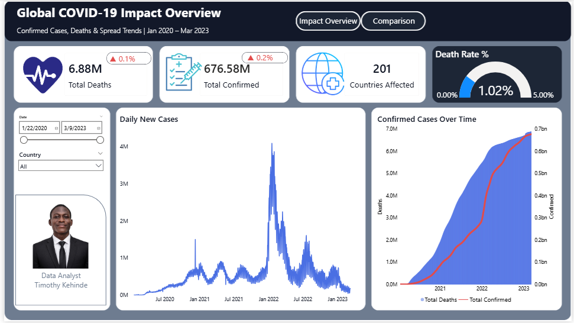
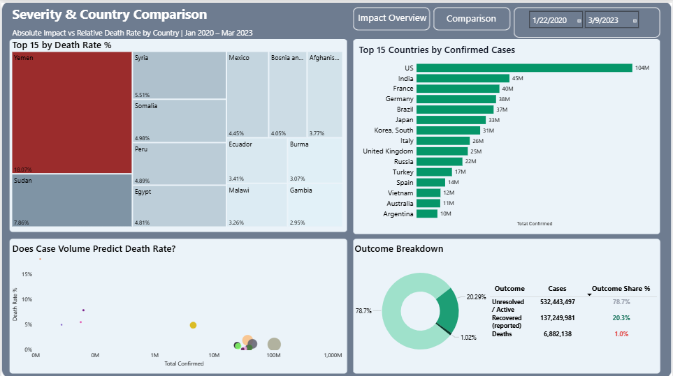

# Global-COVID-19-Impact-Dashboard-Severity-Analysis-from-Raw-JHU-Data
A 229,743-row analytical model transforms raw CSSE time-series files through a full unpivot-group-merge ETL pipeline. The project catches a critical 6x data aggregation error before publishing, applies a statistical threshold to eliminate small-sample distortion, and surfaces a major counter-intuitive finding: case volume does not predict severity.

**A two-page dashboard built on a dataset that punishes lazy aggregation.** Three years of JHU CSSE case data, turned into a global severity analysis, and a case study in catching a data error before it became a wrong conclusion.

---

## The Problem

Most COVID dashboards answer one question: how many cases. This one was built to answer three, because raw case counts alone tell a health policy analyst almost nothing useful:

> How fast did COVID-19 actually spread, who was hit hardest, and can the data itself be trusted?

That third question turned out to matter more than expected. A meaningful part of this project was not charting the data, it was interrogating it, catching where the numbers were wrong, misleading, or simply missing, before putting them in front of a decision-maker.

---

## The Critical Moment: A 6x Error, Caught Before It Shipped

Early in the build, the Total Confirmed KPI displayed **103.80M**. It looked plausible. It was wrong.

I had written the measure using `MAX(Covid_Global[Confirmed])`, expecting it to return the global total. Instead, `MAX` scanned the entire column and returned the single largest value in it, which turned out to be the United States' cumulative count alone, not the sum across 201 countries.

Rather than accept a number that merely looked reasonable, I cross-checked it against the raw source files directly. The actual global total was **676.58M**, a gap of more than 570 million cases. The fix required rethinking the aggregation logic entirely, not summing the column, which would have double-counted every cumulative day, but collapsing each country to its own latest value first, then summing those:

```dax
Total Confirmed =
SUMX(
    VALUES(Covid_Global[Country/Region]),
    CALCULATE(MAX(Covid_Global[Confirmed]))
)
```

This is the difference between a dashboard that renders without error and a dashboard that is actually correct. The first is a formatting problem. The second is a trust problem, and it is the one that matters when someone is going to make a decision based on the number.

---

## ETL Process

The three source files arrived in a shape no chart can use directly: one row per country, and 1,143 separate columns, one per date. Every transformation below happened in Power Query before a single visual was built.

### 1. Import
Each of the three files, `time_series_covid19_confirmed_global.csv`, `time_series_covid19_deaths_global.csv`, and `time_series_covid19_recovered_global.csv`, was imported as its own query and headers were explicitly promoted, since the raw files did not auto-detect a header row on load.

### 2. Unpivot
For each query, `Province/State`, `Country/Region`, `Lat`, and `Long` were selected and held fixed, and every date column was unpivoted into two columns: `Date` and a value column (`Confirmed`, `Deaths`, or `Recovered` depending on the file). This turned each wide file into a long, one-row-per-country-per-day table, roughly 330,000 rows per file before further processing.

### 3. Group
Each unpivoted table was grouped by `Country/Region` and `Date`, summing the value column. This step is the assumption worth stating plainly: **province and state-level detail was deliberately collapsed into national totals.** Only a handful of countries, the US, Canada, China, Australia, and the UK among them, report province-level breakdowns in this dataset, and every other country has a single row per day. Collapsing to country level kept the model consistent across all 201 countries and matched the scope of the business questions this dashboard answers, none of which required sub-national detail. This step also had the side effect of dropping Lat and Long, which were not needed once the analysis moved to country-level comparison rather than geographic plotting.

### 4. Merge
The three grouped queries were merged into one table, matching on `Country/Region` and `Date` together, not `Country/Region` alone, to avoid cross-joining mismatched dates. Confirmed was used as the base query, with Deaths and then Recovered merged in as left outer joins and their value columns expanded. The result, renamed `Covid_Global`, holds five columns: `Country/Region`, `Date`, `Confirmed`, `Deaths`, `Recovered`, at 229,743 rows.

### 5. Staging queries disabled from load
The original Deaths and Recovered queries remain in the file as staging queries feeding the merge, but their **Enable Load** setting was turned off, so they do not appear as separate tables in the data model. Only `Covid_Global` loads into the report.

### 6. Date dimension
A dedicated Date table was built with `CALENDAR(DATE(2020,1,22), DATE(2023,3,9))`, bounded to the dataset's actual range rather than an auto-generated calendar, marked as an official Date table, and related to `Covid_Global[Date]` on a one-to-many relationship.

---

## What I Found

- **Case growth was not linear, it moved in waves.** The Daily New Cases chart shows a peak in January 2022 that dwarfs every prior surge, consistent with the global Omicron wave.
- **Case volume does not predict severity.** The US and India lead by confirmed case count but sit at moderate death rates. Yemen, with a fraction of their case count, recorded the highest death rate in the dataset at **18.07%**.
- **78.7% of all confirmed cases have no recorded outcome** in the data, neither death nor recovery. This is not 78.7% of the world still actively sick years later. It is a reporting gap, and treating it as anything else would be a misread of the data, not a finding about the pandemic.
- **Severity clusters outside the highest-volume countries.** Sudan, Somalia, Syria, and Peru all posted death rates well above the 1.02% global average, despite comparatively low case counts, a pattern that points toward healthcare capacity rather than raw exposure.

---

## Problem-Solving, Chart by Chart

**The map that would not render correctly.** Power BI's classic Filled Map visual is being deprecated, and its Azure Maps replacement renders as bubbles, not shaded country shapes, so a death-rate choropleth never displayed as intended no matter how the gradient was configured. Rather than keep forcing a deprecated tool to behave, I pivoted to a Treemap for the same comparison, a decision that traded literal geography for a visual that actually works.

**The scatter chart that hid its own insight.** Plotting all 195+ countries on a Confirmed-vs-Death-Rate scatter chart produced a wall of overlapping dots with no readable pattern. I filtered to a deliberate set of countries representing both extremes, high volume and high severity, added a logarithmic X-axis to handle the enormous gap between the US's case count and smaller nations, and only then did the actual relationship, or lack of one, become visible.

**The treemap that was lying by omission.** An early version of the death-rate treemap was dominated by MS Zaandam, a cruise ship, not a country, and North Korea, both distorted by extremely small case denominators producing statistically unstable percentages. I added a minimum case-count threshold before any death rate comparison was allowed to render, a rule now documented directly in this README rather than buried in a script.

**The KPI pill that was quietly wrong twice.** Two growth indicator cards displayed identical percentages, which should have been near-impossible given different underlying metrics. Rather than accept a coincidence, I traced it back through the field bindings, and separately, back to the root aggregation bug above. Both turned out to be real, distinct issues, not one glitch.

---

## Recommendations

1. **Treat death rate, not case count, as the primary severity signal** when prioritizing aid or resource allocation, since the two do not move together.
2. **Flag Recovered-based metrics as directional only.** JHU discontinued consistent recovery reporting for many countries mid-pandemic, and this dataset should not be used for country-level policy decisions without cross-checking a second source.
3. **Prioritize monitoring in countries with low case volume but elevated death rate**, since this pattern is more consistent with limited testing capacity than with genuinely lower spread.
4. **Apply a minimum case-count threshold before comparing death rates across countries.** Small denominators produce misleading percentages, and this dashboard enforces that rule by design, not as an afterthought.

---

## Assumptions and Judgment Calls

Every dataset requires decisions that are not visible in the final dashboard unless someone writes them down. These are mine.

- **Country-level aggregation, not province-level.** Justified above. If a future version of this project needed sub-national analysis for the US, Canada, China, Australia, or the UK specifically, the province-level rows would need to be re-grouped separately from this model.
- **Zero values in Recovered are ambiguous, and were not treated as certainty.** A zero in the Recovered column can mean genuinely zero recoveries that day, or it can mean a country stopped reporting recovery data entirely. The data does not distinguish between the two, and this dashboard does not either, which is exactly why Recovered-based figures are flagged as directional only rather than presented with the same confidence as Confirmed or Deaths.
- **A minimum case-count threshold of 10,000 confirmed cases was applied before any death-rate comparison across countries.** Without it, entities like MS Zaandam, a cruise ship carried in the dataset as if it were a country, and countries with very low official case counts produced death rate percentages driven by small denominators rather than real severity. This threshold is a judgment call, not a value handed down by the source data, and a different threshold would shift which countries appear in the Top 15 severity views.
- **MS Zaandam and similarly non-national entities were excluded from country comparison views entirely**, in addition to the case-count threshold, since including a cruise ship in a list of countries is a category error regardless of its case count.
- **The dataset is treated as historical, not live.** JHU archived this repository in March 2023 and stopped collecting new data. Every figure in this dashboard reflects the pandemic through that date, not the present.

---

## Dashboard Structure

**Page 1, Covid Impact Dashboard**
KPI row (Total Confirmed, Total Deaths, Countries Affected, and a Death Rate gauge benchmarked against a 0-5% scale), a Daily New Cases trend line showing the pandemic's wave pattern, and a dual-axis Confirmed-vs-Deaths growth chart.

**Covid_Impact_Overview**


**Page 2, Covid Comparison Dashboard**
A Top 15 Countries bar chart by confirmed case volume, a Death Rate treemap filtered for statistical reliability, a Confirmed-vs-Death-Rate scatter chart testing whether volume predicts severity, and an Outcome Breakdown donut exposing the 78.7% unresolved-case gap.

**Covid_Comparison_Dashboard**


---

## Tools

Power BI Desktop (data modeling, DAX, dashboard design), Power Query (unpivoting, grouping, and merging three wide-format source files into one clean model), Azure Maps and Treemap visuals.

---

## Skills Demonstrated

Data validation and error detection · ETL design (unpivot, group, merge) · DAX aggregation logic for cumulative time-series data · Statistical judgment on small-sample distortion · Root-cause debugging · Data limitation documentation · Translating a global health dataset into decision-ready insight

---

## A Note on Data Reliability

This dashboard is built on the JHU CSSE COVID-19 Data Repository, licensed under CC BY 4.0. Two limitations are worth stating plainly rather than leaving for a viewer to discover on their own: Recovered case figures are unreliable for many countries after mid-pandemic, and the repository itself has been archived since March 2023, meaning this is a frozen historical dataset, not a live feed. Both limitations are reflected directly in how the dashboard's KPIs and recommendations are framed.

**Data source:** JHU CSSE COVID-19 Data — github.com/CSSEGISandData/COVID-19

---

## Repository Contents

```
├── Covid-19 Healthcare.pbix                       Power BI dashboard file
├── COVID19_Dashboard_Presentation.pptx             Project presentation deck
├── /data
│   ├── time_series_covid19_confirmed_global.csv
│   ├── time_series_covid19_deaths_global.csv
│   └── time_series_covid19_recovered_global.csv
├── /screenshots
│   ├── Covid_Impact_Dashboard.png
│   └── Covid_Comparison_Dashboard.png
└── README.md                                      
```

---

## Author

**Timothy Kehinde**
Data Analyst Intern, AnalystLab Africa

[LinkedIn](https://linkedin.com) · [GitHub](https://github.com) · [Portfolio](https://bit.ly/4qIn19W)
